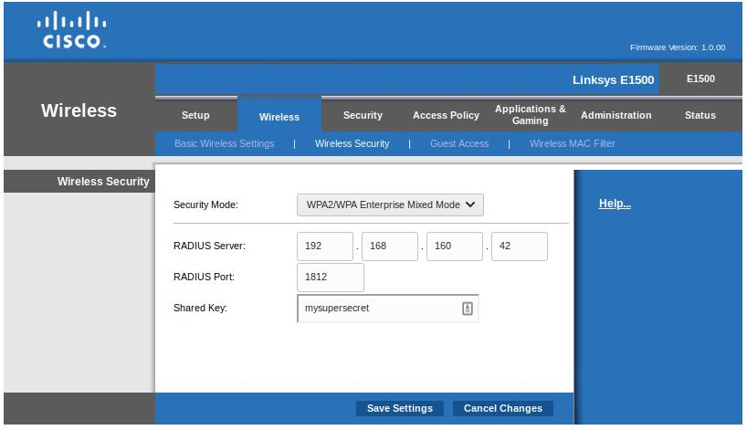

# EAP-TLS Configuration

The following instructions assist in connecting a Wi-Fi enabled device to a WPA2 Enterprise network using the EAP-TLS
protocol, where the authentication credentials is secured using a TPM 2.0 generated key, and accessed using the PKCS#11
standard.

WPA-Enterprise, also referred to as WPA-802.1X mode, is designed for enterprise networks and requires a RADIUS
authentication server. The authentication of clients relies on a Extensible Authentication Protocol (EAP) that includes
many types of authentication schemes. The one used in this setup is EAP Transport Layer Security (EAP-TLS), defined in
RFC 5216.

## RADIUS Server Installation

The RADIUS server implementation used in the example is FreeRADIUS from the FreeRADIUS Project, an open source
implementation of RADIUS, an Internet Engineering Task Force (IETF) protocol for Authorization, Authentication, and
Accounting (AAA).

### Installation on Fedora

```sh
dnf install freeradius
```

Then enable the firewall rule for the RADIUS server:

```sh
firewall-cmd --add-service=radius --permanent
firewall-cmd --reload
```

### Installation on Ubuntu

```sh
cat >> /etc/apt/sources.list <<EOF
deb http://packages.networkradius.com/releases/ubuntu-bionic bionic main
EOF
apt-key adv --keyserver keys.gnupg.net --recv-key 0x41382202
apt update
apt install -y freeradius
```

## RADIUS Server Certificates generation

We will use the "snake oil" test certificates provided by the FreeRADIUS package.

### Certificates Generation in Fedora

```sh
cd /etc/raddb/certs
./bootstrap
make
```

### Certificates Generation in Ubuntu

```sh
cd /etc/freeradius/certs
./bootstrap
make
```

## Configure Access Point client access

In the RADIUS infrastructure, the Access Point (AP) is known as the client of the RADIUS server. The Wi-Fi connecting
devices will be referred to as the Supplicants. Add the following section to the end of the `clients.conf` file to allow
the access point to authenticate using this RADIUS Server, updating the IP address of the AP reflecting your network
setup:

### Client Access configuration in Fedora

```sh
cat >> /etc/raddb/clients.conf <<EOF
client ap {
    ipaddr   = 192.168.1.1
    secret   = mysupersecret
}
EOF
```

### Client Access configuration in Ubuntu

```sh
cat >> /etc/freeradius/clients.conf <<EOF
client ap {
    ipaddr   = 192.168.1.1
    secret   = mysupersecret
}
EOF
```

## Wi-Fi Access Point Configuration

Now configure the AP to authenticate using a RADIUS Server. Use the IP address of the RADIUS Server and the secret.
These steps depend on the type of AP available. As an example, this guide shows how to use a Cisco Linksys E1500,
setting the Wireless Security as "WPA2/WPA Enterprise Mixed Mode" with the RADIUS Server IP and shared secret.

<p>
  

## Configure Supplicant Access

This step adds a Supplicant user to the RADIUS server. Add the following section to the `authorize` file describing a
testing user:

### Configure Supplicant Access in Fedora

```sh
cat >> /etc/raddb/mods-config/files/authorize <<EOF
testing
    Reply-Message := "Hello, %{User-Name}"
EOF
```

### Configure Supplicant Access in Ubuntu

```sh
cat >> /etc/freeradius/mods-config/files/authorize <<EOF
testing
    Reply-Message := "Hello, %{User-Name}"
EOF
```

## Run FreeRADIUS in debug mode

Run the FreeRADIUS server in debug mode for the initial setup: At the end of the log messages, you should see this
message:

```sh
Ready to process requests
```

The AP and RADIUS server setup is now completed.

### Run FreeRADIUS in Fedora

```sh
radiusd -X
```

### Run FreeRADIUS in Ubuntu

```sh
freeradius -X
```

## Supplicant Setup

Supplicant refers to each device wirelessly connecting to the previously configured APs.

### Supplicant Dependencies

The following packages and versions are required to complete this setup

1. tpm2-tss 2.4.0
2. tpm2-tools 4.1.2
3. tpm2-pkcs11 1.2.0
4. tpm2-pkcs11-tools 1.2.0
5. wpa_supplicant 2.9.3
6. gnutls-tools 3.6.13
7. NetworkManager 1.22.10

### RADIUS Server Certificate Authority (CA) installation

Download the RADIUS Server CA in the Supplicant system. The certificates can be found in the RADIUS server `certs`
directory. Install the RADIUS Server CA in the `/etc/pki/SSID/ca.pem` location.

#### CA Location in Fedora

```sh
cat /etc/raddb/certs/ca.pem
```

#### CA Location in Ubuntu

```sh
cat /etc/freeradius/certs/ca.pem
```

### Certificate Signing Request (CSR) Generation

Using the `tpm2-pkcs11` as a cryptographic engine for `openssl`, generate a CSR in the Supplicant system. A Private Key
needs to be created in the TPM 2.0 Credential Storage system, and the CSR is derived from this key.

```sh
mkdir -p /etc/tpm2_pkcs11

export TPM2TOOLS_TCTI="device:/dev/tpmrm0"
export TPM2_PKCS11_TCTI="device:/dev/tpmrm0"

tpm2_ptool init
tpm2_ptool addtoken \
    --pid=1 \
    --sopin=sopin \
    --userpin=userpin \
    --label=label
tpm2_ptool addkey \
    --algorithm=rsa2048 \
    --label=label \
    --userpin=userpin
tpm2_ptool config \
    --key tcti \
    --value "device:/dev/tpmrm0" \
    --label label
TOKEN=`p11tool --list-token-urls | grep "token=label"`
export GNUTLS_PIN=userpin
export GNUTLS_SO_PIN=sopin
p11tool --login --list-all "${TOKEN}" --outfile p11tool.out
PRIVATE_KEY=`cat p11tool.out | grep private | awk '{ print $2 }'`
SUBJ="/C=FR/ST=Radius/L=Somewhere/O=Example Inc./CN=testing/emailAddress=testing@test.com"
openssl req \
    -new \
    -engine pkcs11 \
    -keyform engine \
    -key "${PRIVATE_KEY};pin-value=userpin" \
    -subj "${SUBJ}" \
    -out client.csr
```

### Client Certificate Generation

In order to sign the Certificate Signing Request and get a valid Client Certificate for the supplicant system, send the
CSR file to the RADIUS Server, and sign it using the RADIUS Server Certificate Authority in the `certs` folder. By
default, the private key password of the testing certificate is `whatever`.

```sh
openssl ca \
    -batch \
    -keyfile ./ca.key \
    -cert ./ca.pem \
    -passin pass:whatever \
    -in client.csr \
    -out client.crt \
    -extensions xpclient_ext \
    -extfile xpextensions \
    -config client.cnf
```

Send the Client Certificate to the Supplicant system to complete the setup. Install the Client Certificate in the
`/etc/pki/SSID/client.crt` location.

### WPA Supplicant Configuration

Generate a `wpa_supplicant` configuration file. The `private_key` attribute is a PKCS#11 URI specifying the private key
stored in the TPM 2.0. It can be queried using the `p11tool` command using the user PIN.

```sh
cat > wpa_supplicant.conf <<EOF
network={
    ssid="SSID"
    key_mgmt=WPA-EAP
    eap=TLS
    identity="testing"
    ca_cert="/etc/pki/SSID/ca.pem"
    client_cert="/etc/pki/SSID/client.crt"
    private_key="pkcs11:model=Intel;manufacturer=Intel;serial=0000000000000000;token=label;id=%32%62%37%30%65%62%36%32%66%33%32%62%31%63%65%37;object=0;type=private;pin-value=userpin"
}
EOF
```

To start the authentication process, use `wpa_supplicant` specifying the correct wireless interface in the Supplicant
system.

```sh
wpa_supplicant -c wpa_supplicant.conf -i wlp1s0
```

An example output of a successful authentication request is shown below for reference.

```text
Successfully initialized wpa_supplicant
wlp1s0: SME: Trying to authenticate with 58:6d:8f:9d:2f:9e (SSID='SSID' freq=2462 MHz)
wlp1s0: Trying to associate with 58:6d:8f:9d:2f:9e (SSID='SSID' freq=2462 MHz)
wlp1s0: Associated with 58:6d:8f:9d:2f:9e
wlp1s0: CTRL-EVENT-SUBNET-STATUS-UPDATE status=0
wlp1s0: CTRL-EVENT-EAP-STARTED EAP authentication started
wlp1s0: CTRL-EVENT-EAP-PROPOSED-METHOD vendor=0 method=4 -> NAK
wlp1s0: CTRL-EVENT-EAP-PROPOSED-METHOD vendor=0 method=13
wlp1s0: CTRL-EVENT-EAP-METHOD EAP vendor 0 method 13 (TLS) selected
wlp1s0: CTRL-EVENT-EAP-PEER-CERT depth=1 subject='/C=FR/ST=Radius/L=Somewhere/O=Example Inc./emailAddress=admin@example.org/CN=Example Certificate Authority' hash=4953d5815718f3e6c082969bd950d84c1b8dbba87cb45c4b15335387b34abdb8
wlp1s0: CTRL-EVENT-EAP-PEER-CERT depth=0 subject='/C=FR/ST=Radius/O=Example Inc./CN=Example Server Certificate/emailAddress=admin@example.org' hash=677cee54ddad924c818909397a5b3d1a8ff64d45ab8796648d47aa5fdc2d3f8f
wlp1s0: CTRL-EVENT-EAP-SUCCESS EAP authentication completed successfully
wlp1s0: WPA: Key negotiation completed with 58:6d:8f:9d:2f:9e [PTK=CCMP GTK=TKIP]
wlp1s0: CTRL-EVENT-CONNECTED - Connection to 58:6d:8f:9d:2f:9e completed [id=0 id_str=]
```

### Network Manager Configuration

Specify the PKCS11 Store location that `wpa_supplicant` should use:

```sh
echo "TPM2_PKCS11_STORE=/etc/tpm2_pkcs11" >> /etc/sysconfig/wpa_supplicant
```

Restart the `wpa_supplicant.service` daemon with the new configuration:

```sh
systemctl restart wpa_supplicant.service
```

Add the following Network Manager connection configuration:

```sh
nmcli connection add type wifi ifname wlp1s0 con-name 'SSID' \
    802-11-wireless.ssid SSID \
    802-11-wireless-security.key-mgmt wpa-eap \
    802-1x.eap tls \
    802-1x.identity testing \
    802-1x.ca-cert /etc/pki/SSID/ca.pem \
    802-1x.client-cert /etc/pki/SSID/client.crt \
    802-1x.private-key 'pkcs11:model=Intel;manufacturer=Intel;serial=0000000000000000;token=label;id=%32%62%37%30%65%62%36%32%66%33%32%62%31%63%65%37;object=0;type=private;pin-value=userpin' \
    802-1x.private-key-password-flags not-required
```

For system that uses SELinux, like Fedora, we need to allow Network Manager to access to the TPM and the TPM Resource
Manager.

The `etc_t` write access is also provide to allow interaction with the PKCS#11 database in `/etc/tpm2_pkcs11`.

```sh
cat > nm-selinux.te <<EOF

module nm-selinux 1.0;

require {
    type NetworkManager_t;
    type etc_t;
    type tpm_device_t;
    class file { write };
    class chr_file { open read write };
}

#============= NetworkManager_t =============
allow NetworkManager_t etc_t:file write;
allow NetworkManager_t tpm_device_t:chr_file { open read write };
EOF

checkmodule -M -m -o nm-selinux.mod nm-selinux.te
semodule_package -o nm-selinux.pp -m nm-selinux.mod
semodule -i nm-selinux.pp
```

Activate the connection

```sh
nmcli connection up SSID
```

An example output of successful connection activation is shown below for reference:

```text
Connection successfully activated (D-Bus active path: /org/freedesktop/NetworkManager/ActiveConnection/13)
```
```
