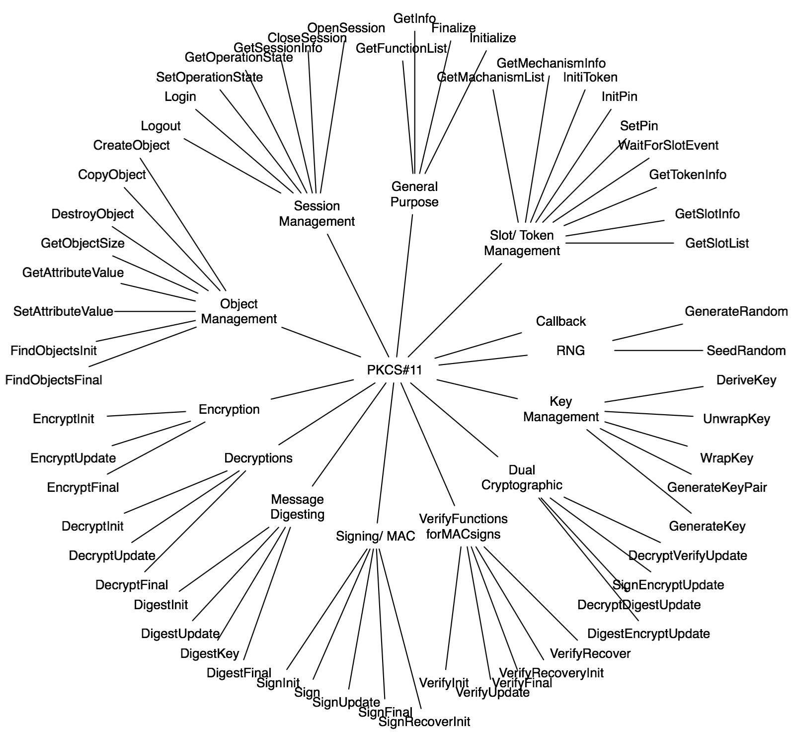

# tpm2-pkcs11

PKCS #11 is a Public-Key Cryptography Standard that defines a standard method to
access cryptographic services from tokens/ devices such as hardware security
modules (HSM), smart cards, etc. In this project we intend to use a TPM2 device
as the cryptographic token.

## PKCS#11 - Profiles

Implementation profiles build incrementally. Supported API, data-types, objects,
functions and mechanisms parameters determine the implementation profile/ level.

1. Baseline Consumer
2. Baseline Provider
3. Extended Consumer
4. Extended Provider
5. Authentication Token

## PKCS#11 API Classification

