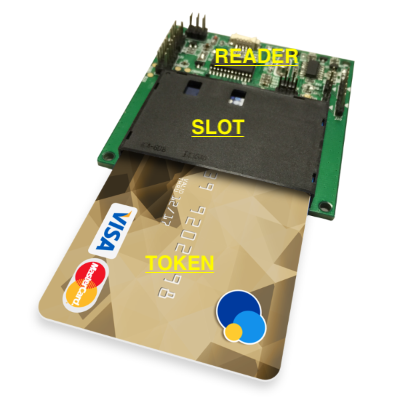
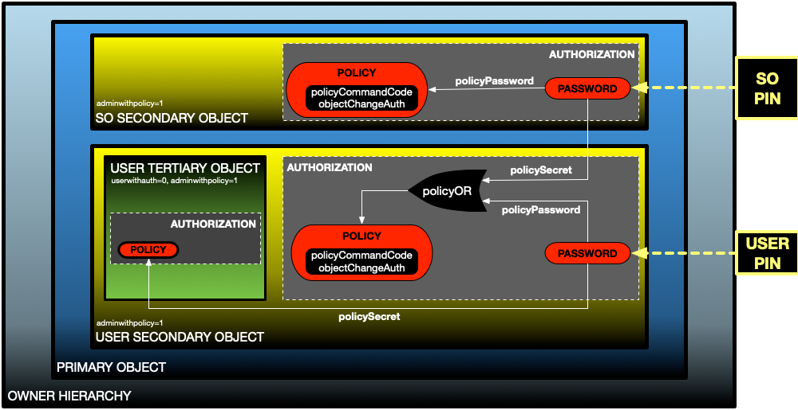
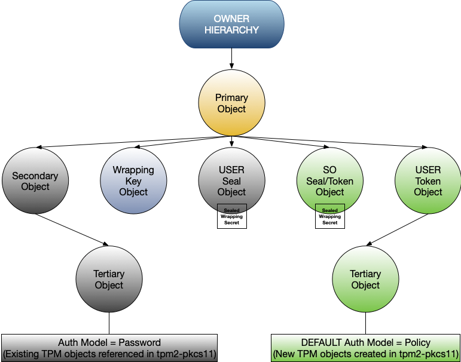

# tpm2-pkcs11 object model:

## PKCS11 Roles
The PKCS11 design describes two specific roles - A security-officer or **SO**
and user or **USER**. SO and USER roles are realized with separate
authentications. The authentications can be PIN based authentications. Neither
SO nor USER can know each other pin.  
The SO is restricted to an administrative role to modify SO PIN and or an
existing USER's pin. While both **the SO and the USER can change USER pin**,
only a SO can change SO pin.  
USER authentication pin is a must for creating and operating on USER objects.
The SO cannot create or access any USER objects. While SO could **RESET** USER
pin, the **SO cannot restore the old USER pin**. This design intention prevents
SO from having explicit access to USER objects and also to bring traceability to
security officer actions pertinent to USER pin changes.  
As an example, a token initialized with a SO pin can be setup with a default
USER pin. The USER then changes the pin to his liking which the SO cannot know
& thus cant restore. The USER can now use the new pin to create and operate on
USER objects. If the USER is convinced of forgetting the pin, USER can get the
PIN **RESET** by the SO. However, if the SO resets the USER pin without USER
request, the old USER pin becomes defunct and cannot be restored. Thus requiring
USER to be notified of the new pin and the SO act of changing the USER pin.

## PKCS11 Objects
PKCS11 describes a hierarchical concept of objects

  
 
 
The PKCS11 READER is a means by which information is exchanged with the PKCS11
device or TOKEN. Every READER has a SLOT that may/not contain a TOKEN. The TOKEN
ultimately protects all the USER created objects through an authorization model
to distinguish the SO, USER or adversary.

## TPM2 Objects
To parallel the PKCS11 hierarchical concept, the tpm2-pkcs11 describes the
objects as: 

  
 
 
These TPM entities have a parent:child relationship and hence embody the
intended hierarchical relationship. The primary object’s parent is the TPM OWNER
hierarchy, the secondary object’s parent is the primary object and the tertiary
objects' parent is the secondary object. In general, parent authorization is
required to be able to create a child and once created, to be able to load the
child key under the parent.

## Analogy of object properties in the PKCS11 vs TPM2 object model
The TPM2 standard defines a set of object properties to conform to specific
design. A discussion on important properties of the PKCS11 abstraction should
yield a guide to choosing properties for the TPM2 objects so as to conform to
the PKCS11 standard. 

  

<table style="width:100%">

  <tr>
    <th width="50%">READER</td>
    <th>TPM2 Owner Hierarchy</td>
  </tr>
  <tr>
    <td>
      There is no authorization or authentication challenge to be able to use a
      <b>reader</b>. A reader can have a single or multiple slots.
    </td>
    <td>
       TPM OWNER hierarchy has an associated authorization, typically a password
       . If set, it's required to create and load child primary objects. Once
       the primary object is made persistent OWNER password is not required.
    </td>
  </tr>
  <tr>
    <td>
      Reader does not store/protect USER objects directly but is simply a medium
      of communication.
    </td>
    <td>
      OWNER hierarchy is simply a parent to the primary objects and consequently
      any objects that are subsequently created under the primary objects.
    </td>
  </tr>

  <tr>
    <th>SLOT</td>
    <th>TPM2 Primary Objects</td>
  </tr>
  <tr>
    <td>
      There is no authorization or authentication challenge to be able to use a
      <b>slot</b>.
    </td>
    <td>
      Primary objects can be created without a password authorization.
    </td>
  </tr>
  <tr>
    <td>
      Does not store/protect USER objects directly. Slots are the logical
      partitions in the cryptographic device. When a slot is initialized in HSM
      then the token is present in the slot.
    </td>
    <td>
      Multiple distinct primary objects can be created under same owner
      hierarchy. Secondary objects can be created/loaded under a primary object.
    </td>
  </tr>

  <tr>
    <th>TOKEN</td>
    <th>TPM2 Secondary Objects</td>
  </tr>
  <tr>
    <td>
      <b>Token</b> is a device where application stores the cryptographic
      objects and also perform cryptographic operations. USER role is required
      to create and operate on USER objects. A Security Officer or SO role is
      required to initialize or modify USER role authentication.
    </td>
    <td>
      TPM objects' authorization can be compounded with multiple authentications
      . Further, we can also limit certain operations on the objects to a
      specific authentication.
    </td>
  </tr>
  <tr>
    <td>
      Tokens share a one to one relationship with the Slots. An initialized slot
      must have a token. While multiple tokens can exist, only a single token is
      active per slot. All the tokens have the SO and USER roles specified.
    </td>
    <td>
      Distinct secondary objects with same authorization parameters can be
      created with each call to create secondary objects with the primary object
      as the parent. While loading multiple objects simultaneously is possible
      in a TPM, we could restrict it in system software.
    </td>
  </tr>

  <tr>
    <th>USER Objects</td>
    <th>TPM2 Tertiary Objects</td>
  </tr>
    <tr>
    <td>
      Tokens do not perform cryptographic operations directly, rather the
      objects that the USER creates do.
    </td>
    <td>
      Distinct tertiary objects sharing same authorization method can be created
      . Each call to create tertiary objects with the secondary object as the
      parent will yield a unique object.
    </td>
  </tr>
  <tr>
    <td>
      Only USER role authorization can create and operate on the USER objects.
      USER role authentication pin can be changed and all the USER objects
      created should assume the new authentication pin as the authorization
      secret.
    </td>
    <td>
      TPM objects can be created with a referred authorization model, where in
      the authentication data of another object and any changes to it is assumed
      by the newly created TPM objects.
    </td>
  </tr>

</table>

## Summary of TPM2 Object properties to conform to PKCS11 object design
 

  
 

### The Owner hierarchy
1. TPM2_RH_OWNER must not be disabled. This is intended in the design to enable
loading the PKCS11 objects between TPM restarts resulting from system resets/
power modes.
2. Owner hierarchy authorization is required for 2 operations:
 Creating primary object
 Persisting the primary object in TPM NV memory.

### The Primary Object
1. It must be persistent and passwordless.
2. Primary object represents a SLOT and can load multiple secondary-objects
representing tokens.
3. Unlike other cryptographic devices multiple tokens can be loaded
simultaneously at the same slot in that multiple secondary objects can be loaded
under same primary object.
4. NOTE: It is possible to use primary objects with a non empty authorization.
The primary object auth must be known or protected with the SO and USER
secondary objects' pin/auth. This because it will be needed to load the
secondary objects. This can be achieved by a PBKDF scheme and saving the
salt/iteration pair for each of the SO and USER pin/auth as the secret input to
the PBKDF.

### The Secondary Object
1. A token is manifested by two specific roles SO and USER each represented by a
secondary object. Hence each token is a pair of secondary-objects.
2. Security Officer or SO secondary object auth is the SO PIN.
3. SO object's auth can only be changed by the SO. Meaning a SO object auth loss
cannot be reset or restored.
4. The SO object auth and the auth of the USER secondary object can be
alternatively used to change the existing USER pin/auth. This is achieved by
setting up the USER object authorization with a policy that compounds the SO and
USER auths.
5. The SO object pin/auth cannot be used to create/load/operate on the USER
tertiary objects since SO auth is not referred in tertiary objects' auth.

### The Tertiary Objects (USER objects)
1. These are ultimately the objects protected by TPM token as a PKCS11 provider.
2. Authorization of each tertiary object is through a policy that refers the USER
secondary object auth.
3. USER tertiary objects are not restricted and can be used in cryptographic
operations.
4. USER PIN alone is both required and sufficient to create and operate on these
objects.
5. SO PIN or SO secondary objects auth is not referred in any form when creating
tertiary objects and thus SO pin has no control on these objects.
6. These tertiary objects are created with USER secondary object as the parent.
7. NOTE: Externally created objects could also be imported. In this scheme
however, any passphrases associated with the external object must be stripped
and replaced with the tertiary object authorization policy mentioned in point 2.

## Using existing TPM objects with PKCS11

Using existing TPM objects with with tpm2-pkcs11 presents unique challenges. In
that, authentication secret/passphrase can be changed but not it's policy. Since
the object was already created a policy cannot be attached when adding such an
object to the tpm2-pkcs11 user objects. This could be handled in one of three
ways.
1. Re-Encrypt all data with new set of keys with auth policies discussed above.
If the keys are used for digital signing/identity, this method may require
re-certifying to the new set of keys.
2. An alternative auth model without policies. The primary disadvantage here is
that all USER objects' authentication passphrase need to be sealed by both SO
and USER pin. This because there is no way to restore/reset a lost USER pin.
The unintended effect then is that it gives SO explicit access to USER objects.
3. A hybrid solution where in every such object that was created outside the
tpm2-pkcs11 API will require it's auth sealed by both SO and USER sealing
objects. And every new object created with tpm2-pkcs11 be created with policies
discussed in the section *Summary of TPM2 Object properties to conform to PKCS11
object design* Essentially there can be a reuse of the token definition SO and
USER objects to further act as sealing objects. The sealing objects seal the
secret used as the auth for the wrapping key object that encrypts the auth for
the USER objects OR the sealed secret could directly be used as the auth for a
software based encryption. One caveat of this approach is that the same object
used as a sealing object cannot be used as a parent object to user objects due
to conflicting key attributes. This necessitates an additional USER sealing
object for protecting the wrapping key secret. The key diagram below describes
the hybrid approach.
 

  
 
