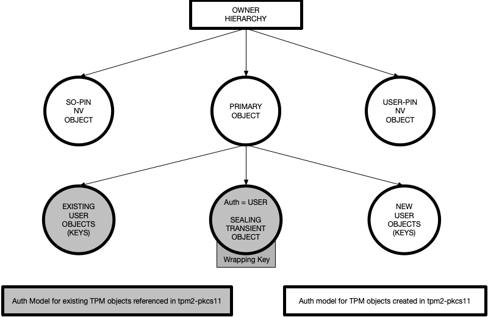
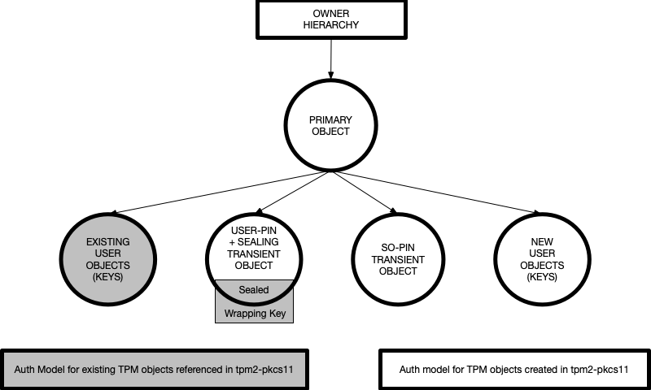

# tpm2-pkcs11 object & authorization model

## Introduction

The objective of this document is to present an architectural overview of the
tpm2-pkcs11 object and authorization model **TO BE IMPLEMENTED** in the design.
The topics covered here in are:

1. [PKCS11 Objects](#pkcs11-objects)
2. [PKCS11 Roles](#pkcs11-roles)
3. [TPM2 Objects](#tpm2-objects)
4. [tpm2-pkcs11 Objects](#tpm2-pkcs11-objects)
5. [NV Object Diagram](#nv-object-diagram)
6. [NV Policy Diagram](#nv-policy-diagram)
7. [Transient Object Diagram](#transient-object-diagram)
8. [Transient Policy Diagram](#transient-policy-diagram)
9. [Sample tpm2-tools implementation](#sample-tpm2-tools-implementation)
10. [Important note on authorization](#important-note-on-authorization)

## PKCS11 System Design

The PKCS11 system design components are illustrated in the following diagram.
<p>
  
<br>
<br>

* READER is a medium through which information is exchanged with TOKEN.

* SLOT is integral with the READER for housing a TOKEN.

* The TOKEN ultimately protects the PKCS11 objects defined in the specification.
It provides an authorization model to distinguish the SO, USER, system
or adversary role based actions.

* Following is a broad classification of PKCS11 objects:
  1. Hardware feature objects - Clock, Monotonic-Counters, USER-Interface.
  2. Storage objects, Data objects - USER defined data with choice of attributes.
  3. Certificate objects - X509, WTLS public key certificates and attributes.
  4. Key type objects - Public key object, Private key object, Secret key object.
  5. Mechanism objects - various mechanisms for operating on the token objects.
  6. Domain objects - Extended algorithm parameter definition.
  7. Profile objects - Info on subsets of functionalities grouped as profiles.

## PKCS11 Roles

The PKCS11 design describes two specific roles: The security-officer or **SO**
and the **USER**. Following are some relevant design considerations when
comparing the roles:

* The SO-PIN and USER-PIN info differentiates the role based accesses for the
security officer and the user. Hence, PIN information should remain a secret to
the specific role.

* Either SO-PIN or USER-PIN can be used to modify USER-PIN.

* SO-PIN alone must be used to modify SO-PIN.

* The SO-PIN cannot be used to access mechanisms or modify objects requiring
USER-PIN.

* The SO-PIN cannot be used to restore or read a non default USER-PIN. This is
intentional in the design to prevent the security officer from having explicit
access to USER objects and also to bring traceability to security officer's
action of changing USER-PIN.

* PINs should not be easy to brute force. In the design **TO BE IMPLEMENTED**
there are two protections in place to deter brute forcing of the PIN:
  1. Use of PBKDF2 to enhance a weak PIN. The SALT used in this operation adds
  to the list of system or user secrets.
  2. The SO-PIN and USER-PIN reference TPM2 objects are dictionary lockout
  protected, thus rate limiting the attack even further.<br>

  An attack would need to: Access SALT--> Guess PIN--> Run PBKDF2--> Attempt
  auth on a dictionary attack protected TPM2 object.

* PIN changes should revoke accesses to mechanisms and objects created/ defined
with the older PIN. NOTE: This is currently only possible with NV Indexes being
used as SO-PIN and USER-PIN auth reference objects.
<br>

**Example** A token is initialized with default SO-PIN and default USER-PIN.
The user changes the USER-PIN to a non default value that the security officer
cannot know and thus cannot read/ restore. If the user forgets the USER-PIN, the
SO-PIN can be used to reset USER-PIN to a default value. However, if the
security officer uses the SO-PIN to reset the USER-PIN without user's knowledge
or request, the user's original or non-default USER-PIN cannot be restored or
used; thus revealing the security officer's action of changing the USER-PIN.

## TPM2 Objects

The TPM2 standards defines various types of objects - permanent, transient,
persistent, non-volatile or NV, etc. There are TPM entities that have a parent:
child relationship and hence embody the intended hierarchical relationship
defined by PKCS11. The hierarchical arrangement of objects is manifested by the
protection of encryption keys derived from parent seed values. These encryption
keys protect the sensitive portion of the child objects. The hierarchical
arrangement can also be manifested simply as an access control to define or
access non volatile objects. In general, parent authorization is required to be
able to authorize creation or defining of the child object and or operate on
them.
<br>

Generally, there are two types of actions that can be performed on TPM2 objects.
(1) Administrative operations like changing the authorization etc. and (2) USER
operations like unseal, encryption etc. These two roles can be restricted to two
separate authorizations at object creation time with attributes - userwithauth/
adminwithpolicy.
<br>

Generally, there are two authorization methods: (1) Authorization password that
can be sent as a plain text or an HMAC and (2) Policy based authorization that
validate certain TPM metrics or parameters.
<br>

It is also possible to associate the authorization value of one object as the
authorization of another object through an authorization policy. One caveat of
changing authorization value of a derived objects is that it does not invalidate
the old object's auth; instead new object is created that protects the same
sensitive information. Also, while auth values can be altered the authorization
policy cannot be changed.

### The TPM2 hierarchy authorization

This is the parent node of all the possible child objects to be created. At the
root of the node is a seed value called storage primary seed used to derive keys
to protect the sensitive portion of primary objects. There are 4 hierarchies:
Platform, Owner, Endorsement and NULL hierarchy. Only Platform and Owner
hierarchies can authorize defining and managing of NV objects. Hierarchy
authorization must be satisfied to create/ access primary objects and define/
access NV objects.

### The TPM2 primary object authorization

Except for NULL hierarchy, the storage primary seeds remain persistent across
TPM2 resets. Thus the primary objects under all other hierarchies can be
recreated. Once the primary object is created it can be made persistent. A
persistent and password-less primary object does not require any further
authorization to use even after TPM2 reset. This is ideal since it addresses the
need to have a password-less parent in a scenario where multiple child objects
ought to be created without requiring the TPM2 hierarchy authorization.
NOTE: (1) While NULL hierarchy does not need authorization, all objects created
under it are lost after TPM2 reset since the NULL hierarchy seed is valid only
until TPM2 reset. (2) Primary objects can also be defined with with a password
which will need to be a well known value for the system.
<br>

In the design this object type is used simply as a necessary parent object to
be able create the derived objects which define most of the design.

### The TPM2 derived object

Primary objects are also derived objects created using TPM2_CreatePrimary.
However this paragraph describes the objects protected with keys derived from
the seed values of the primary objects. Such an object is created with the
invocation of the TPM2_Create command. Every invocation results in creation of a
unique object. The uniqueness is a result of TPM generated data in the sensitive
portion of the object. This object can be saved off the TPM or made persistent
into the TPM NV memory to be reusable between boots.
<br>

In the design this object type is used to define the SO-PIN/ USER-PIN auth
reference objects (transient object auth model), USER (keys) objects and the
Wrapping-Key-Sealing object.

### The NV Index/ object

There are two types of TPM NV objects - those that are remain persistent after
creating/ importing the objects under a TPM hierarchy OR those defined as NV
indexes to hold user defined data. NV index of size 0 is a valid definition. An
NV index can have an authorization password and or policy for administrative and
or user operations. Unlike the derived objects, the NV index object
authorization is not used in the encryption of sensitive data. The NV index
object authorization simply protects read and write access to the object. Thus
no new NV indexes need to be defined when changing the authorization.
<br>

In the design this object type is used define the SO-PIN/ USER-PIN auth
reference objects.

## tpm2-pkcs11 objects

This section gives a general overview of the object and authorization model
design with TPM2 objects. The SO and USER role separation is realized in the
tpm2-pkcs11 design by two unique TPM2 objects, either transient objects or
NV-indexes. The authorization values chosen for these objects are further
utilized in creating specialized authorization policies that render the special
properties of the SO-PIN object, USER-PIN object, Wrapping-Key-Sealing object
and the USER(keys) objects.

1. SO-PIN authorization object: The auth value of this object authorizes auth
value change of SO-PIN and USER-PIN objects. This is either an NV index or a
transient derived object with the primary object as the parent.

2. USER-PIN authorization object: The auth value of this object is used as an
auth value of USER-PIN, Wrapping-Key-Sealing, and USER(keys) objects.
The USER-PIN object auth value OR SO-PIN object auth value can authorize change
of USER-PIN object auth value. This is either an NV index or a transient derived
object with the primary object as the parent.

3. Wrapping-Key sealing object: The authorization value of this object is
referenced off the USER-PIN object with a policy. The object itself doesn't have
a auth value of it's own and so the unsealing user operation would need the auth
satisifed through a policy requiring USER pin. It seals a wrapping key used to
encrypt the auth value of existing TPM2 objects to be assumed into the
tpm2-pkcs11 model. This is a transient derived object with the primary object as
the parent.

4. USER(keys) object: The authorization model is same as the Wrapping-Key
sealing object and thus requires the USER-PIN object auth value via a policy.
These are user created keys and objects that are used in user operations like
encryption, decryption, signing, verification, etc. These are transient derived
objects with the primary object as the parent.
<br>

NOTE:
  * All derived objects with the primary object as parent are saved off the
  TPM . This involves saving two types of information about the derived objects
  to be able to load the objects back again to the TPM. Sensitive information
  which can be private portion of an asymmetric key or the symmetric encryption
  key. This information for convenience is called private. Sensitive information
  is encrypted with a key derived from the parent seed. The non-sensitive
  information like object attributes, auth policy, public portion of asymmetric
  key etc. which for convenience is called public.
  * If the auth value of the transient derived object is changed it encrypts
  the sensitive/ private portion with a new key that is derived from the parent
  seed and that does not invalidate the old one.
  * Tampering of the public and private files can result in a denial of service
  and so must be protected with appropriate methods like MAC, file/folder/disk
  encryption etc.
  * USER(keys) objects that are defined without using the tpm2-pkcs11 library
  can also be assumed into the tpm2-pkcs11 objects. These in the design are
  called **Existing TPM2 objects**. These are essentially derived objects with
  the primary object as the parent. The auth value of these objects are
  protected by encrypting/ wrapping with a wrapping-key that is sealed as the
  Wrapping-Key sealing object. It should also be noted that while the auth value
  of such objects is wrapped, the tpm2-pkcs11 design does not guarantee the
  protection of an already compromised key. The attacker can load the
  compromised key under the primary object and authorize with the compromised
  auth value. Also noteworthy is the fact that while auth values could be
  changed authorization policy cannot be changed.

## NV object diagram

Overview of the use of the TPM2 NV indexes in the implementation.

<p>
  
<br>

The illustration above is the key/object diagram showing the relationship of the
tpm2-pkcs11 objects. The SO-PIN and USER-PIN objects are NV index objects while
the Wrapping-Key sealing object and the USER(keys) objects are transient derived
objects with the primary object as the parent.

## NV poicy diagram

Overview of policies used to satisfy standards requirements with NV objects used
as SO/ USER-PIN reference objects.

<p>
  
<br>

The illustration above is the policy diagram showing the relationship of the
authorization model used by the tpm2-pkcs11 objects where the SO-PIN and the
USER-PIN objects are NV indexes and the Wrapping-Key-Sealing object and the USER
(keys) objects are transient derived objects with the primary object as the
parent.

## Transient object diagram

Overview of the use of TPM2 transient objects in the implementation.

<p>
  
<br>

The illustration above is the key/object diagram showing the relationship of the
tpm2-pkcs11 objects. The SO-PIN and USER-PIN objects along with the
Wrapping-Key-Sealing object and the USER(keys) objects are transient derived
objects with the primary object as the parent.

## Transient policy diagram

Overview of the policies used to satisfy standards requirements with TPM2
transient object used as SO/ USER-PIN reference objects.

<p>
  
<br>

The illustration above is the policy diagram showing the relationship of the
authorization model used by the tpm2-pkcs11 objects where the SO-PIN and the
USER-PIN objects along with the Wrapping-Key sealing object and the USER (keys)
objects are transient derived objects with the primary object as the parent.

## Important note on authorization

While both authorization models discussed resolve the issue of isolation of SO
and USER roles there is a serious problem with the authorization model where the
SO-PIN and USER-PIN reference objects are transient derived objects with the
primary object as the parent. In that, when the authorization of the objects is
changed it creates a new sensitive portion of the object while the old sensitive
information cannot be invalidated. To that effect, anyone who has a cached copy
of an older object whose pin may have been compromised can still access the USER
objects. This also violates the design consideration set out under "PKCS11 Roles
". A malicious SO could create a second USER-PIN object for their own use, which
the real USER would never know about and thus SO-PIN can be used to access USER
objects.
<br>

The issue can be resolved by using NV indices as SO-PIN and USER-PIN reference
objects instead. Although, we still need the sealing object to seal the
wrapping secret for bringing the existing TPM objects into the pkcs11 fold as
well as the USER(keys) objects. However their auth will be tied to USER-PIN NV
index and so despite the fact that the sealing and user(keys) objects are
transient derived objects with the primary object as the parent, a new sensitive
portion is not created when the auth ought to change since these object simply
reference the authorization of the USER-PIN NV object.
<br>

The authorization model where SO-PIN and USER-PIN reference objects are
transient objects should only be used as a fall-back in situations  like if the
NV indexes are unavailable or if the choice of hierarchy is the NULL hierarchy
or if the owner hierarchy is disabled, etc.

## Sample tpm2-tools implementation

Demonstration of an implementation with tpm2-tools. The tpm2-tools utilities
and the arguments and command line options referenced are from the upcoming
tpm2-tools 4.0 release.

* ***Setting up the reader and slot***
```
tpm2_changeauth -c o ownerauth
tpm2_createprimary -C o -c prim.ctx -P ownerauth
tpm2_evictcontrol -C o -c prim.ctx -P ownerauth 0x81010001
tpm2_flushcontext -t
rm prim.ctx
```

### TRANSIENT

* ***Creating the SO-pin-reference-object - Its a keyedhash that seals some
random data that will not be used. The choice of creating the so object as
a keyedhash object is simply because it takes minimum object attributes
required for this design.***
```
dd if=/dev/urandom bs=1 count=32 status=none | \
tpm2_create -C 0x81010001 -u so_pin_ref_obj.pub -r so_pin_ref_obj.priv \
-a "fixedtpm|fixedparent|userwithauth" -p sopin -i-
```

* ***Policy to enable USER to change USER pin***
```
tpm2_startauthsession -S session.ctx
tpm2_policypassword -S session.ctx
tpm2_policycommandcode -S session.ctx \
-L policy.pass_AND_ccobjch TPM2_CC_ObjectChangeAuth
tpm2_flushcontext session.ctx
rm session.ctx
```
* ***Policy to enable SO to change USER pin***
```
tpm2_load -C 0x81010001 -u so_pin_ref_obj.pub -r so_pin_ref_obj.priv \
-c so_pin_ref_obj.ctx
tpm2_startauthsession -S session.ctx
tpm2_policysecret -S session.ctx -c so_pin_ref_obj.ctx sopin
tpm2_policycommandcode -S session.ctx \
-L policy.secret.so_AND_ccobjch TPM2_CC_ObjectChangeAuth
tpm2_flushcontext session.ctx
rm session.ctx
tpm2_flushcontext -t
rm so_pin_ref_obj.ctx
```

* ***Compounded policy: USER (OR) SO can change the USER pin***
```
tpm2_startauthsession -S session.ctx
tpm2_policyor -S session.ctx \
-l sha256:policy.pass_AND_ccobjch,policy.secret.so_AND_ccobjch \
-L policy.pass_AND_ccobjch__OR__secret.so_AND_ccobjch
tpm2_flushcontext session.ctx
rm session.ctx
```

* ***Create the USER-pin-reference-object - The auth of the USER object can be
changed by either SO or USER. Its a keyedhash that seals wrapping secret. The
wrapping secret is used as a software wrapping key or the auth to a wrapping
object that then encrypts the auth of the existing TPM objects to be assumed
into the pkcs11 token. NOTE: NEVER UNSEAL THE WRAPPING SECRET TO STDOUT.***
```
dd if=/dev/urandom bs=1 count=32 status=none | \
tpm2_create -C 0x81010001 -u user_pin_ref_obj.pub -r user_pin_ref_obj.priv \
-a "fixedtpm|fixedparent|adminwithpolicy|userwithauth" \
-L policy.pass_AND_ccobjch__OR__secret.so_AND_ccobjch -p userpin -i-
```

* ***Policy to use USER ref pin as the auth for creating user objects***
```
tpm2_load -C 0x81010001 -u user_pin_ref_obj.pub -r user_pin_ref_obj.priv \
-c user_pin_ref_obj.ctx
tpm2_startauthsession -S session.ctx
tpm2_policysecret -S session.ctx -c user_pin_ref_obj.ctx \
-L policy.secret.user userpin
tpm2_flushcontext session.ctx
rm session.ctx
tpm2_flushcontext -t 
rm user_pin_ref_obj.ctx
```

* ***Create a sample user object***
```
tpm2_create -C 0x81010001 -u user_object.pub -r user_object.priv \
-a "fixedtpm|fixedparent|sensitivedataorigin|adminwithpolicy|sign|decrypt" \
-L policy.secret.user -G aes
```

* ***Load the sample user object and use it in an operation***
```
#load the user object
tpm2_load -C 0x81010001 -c user_object.ctx -u user_object.pub \
-r user_object.priv

#load the USER pin ref object
tpm2_load -C 0x81010001 -c user_pin_ref_obj.ctx -u user_pin_ref_obj.pub \
-r user_pin_ref_obj.priv

#satisfy the policy of referred auth of the USER pin ref object
tpm2_startauthsession -S session.ctx --policy-session
tpm2_policysecret -S session.ctx -c user_pin_ref_obj.ctx userpin

#perform an operation with the user object
echo "plaintext" > test.txt
tpm2_encryptdecrypt -c user_object.ctx test.txt -o test.enc \
-p session:session.ctx

#close auth session and clean up
tpm2_flushcontext session.ctx 
tpm2_flushcontext -t
rm user_pin_ref_obj.ctx user_object.ctx session.ctx 
```

* ***Change USER pin with USER pin***
```
tpm2_load -C 0x81010001 -u user_pin_ref_obj.pub -r user_pin_ref_obj.priv \
-c user_pin_ref_obj.ctx
tpm2_startauthsession -S session.ctx --policy-session
tpm2_policypassword -S session.ctx
tpm2_policycommandcode -S session.ctx TPM2_CC_ObjectChangeAuth
tpm2_policyor -S session.ctx \
-l sha256:policy.pass_AND_ccobjch,policy.secret.so_AND_ccobjch \
-L policy.pass_AND_ccobjch__OR__secret.so_AND_ccobjch
tpm2_changeauth -C 0x81010001 -c user_pin_ref_obj.ctx \
-p session:session.ctx+userpin -r new_user_pin_ref_obj.priv newuserpin
tpm2_flushcontext session.ctx 
rm session.ctx 
tpm2_flushcontext -t
rm user_pin_ref_obj.ctx
```

* ***Change USER pin with SO pin***
```
tpm2_load -C 0x81010001 -u so_pin_ref_obj.pub -r so_pin_ref_obj.priv \
-c so_pin_ref_obj.ctx
tpm2_startauthsession -S session.ctx --policy-session
tpm2_policysecret -S session.ctx -c so_pin_ref_obj.ctx sopin
tpm2_policycommandcode -S session.ctx TPM2_CC_ObjectChangeAuth
tpm2_policyor -S session.ctx \
-l sha256:policy.pass_AND_ccobjch,policy.secret.so_AND_ccobjch \
-L policy.pass_AND_ccobjch__OR__secret.so_AND_ccobjch
tpm2_load -C 0x81010001 -u user_pin_ref_obj.pub -r user_pin_ref_obj.priv \
-c user_pin_ref_obj.ctx
tpm2_changeauth -C 0x81010001 -c user_pin_ref_obj.ctx -p session:session.ctx \
-r so_new_user_pin_ref_obj.priv sonewuserpin
tpm2_flushcontext session.ctx
rm session.ctx
tpm2_flushcontext -t
rm so_pin_ref_obj.ctx
rm user_pin_ref_obj.ctx
```

* ***Change SO pin with SO pin***
```
tpm2_load -C 0x81010001 -u so_pin_ref_obj.pub -r so_pin_ref_obj.priv \
-c so_pin_ref_obj.ctx
tpm2_changeauth -C 0x81010001 -c so_pin_ref_obj.ctx -p sopin \
-r new_so_pin_ref_obj.priv newsopin
tpm2_flushcontext -t
rm so_pin_ref_obj.ctx 
```

### NV

* ***Policy for SO-PIN ref NV object***
```
tpm2_startauthsession -S session.ctx 
tpm2_policypassword -S session.ctx 
tpm2_policycommandcode -S session.ctx \
-L policy.pass_AND_ccnvobjch TPM2_CC_NV_ChangeAuth
tpm2_flushcontext session.ctx
```
* ***Create SO-PIN ref nv object***
```
SO_NV_INDEX=0x1500015
tpm2_nvdefine -C o -P ownerauth -p defaultsonvpin $SO_NV_INDEX \
-a "authread|authwrite" -s 0 -L policy.pass_AND_ccnvobjch
```

* ***Policy for USER pin change with USER pin***
```
Same as Policy for SO-PIN ref NV object --> policy.pass_AND_ccnvobjch
```

* ***Policy for USER pin change with SO pin***
```
tpm2_startauthsession -S session.ctx
tpm2_policysecret -S session.ctx -c $SO_NV_INDEX defaultsonvpin
tpm2_policycommandcode -S session.ctx \
-L policy.secret.so.nv_AND_ccnvobjch TPM2_CC_NV_ChangeAuth
tpm2_flushcontext session.ctx
rm session.ctx
```

* ***Compounded policy: USER (OR) SO can change the USER pin***
```
tpm2_startauthsession -S session.ctx
tpm2_policyor -S session.ctx \
-l sha256:policy.pass_AND_ccnvobjch,policy.secret.so.nv_AND_ccnvobjch \
-L policy.pass_AND_ccnvobjch__OR__secret.so.nv_AND_ccnvobjch
tpm2_flushcontext session.ctx
rm session.ctx
```

* ***Create the USER pin NV ref object***
```
USER_NV_INDEX=0x1500016
tpm2_nvdefine -C o -P ownerauth -p usernvpin $USER_NV_INDEX \
-a "authread|authwrite" -s 0 \
-L policy.pass_AND_ccnvobjch__OR__secret.so.nv_AND_ccnvobjch
```

* ***Policy to use USER NV ref pin as the auth for creating user objects***
```
tpm2_startauthsession -S session.ctx
tpm2_policysecret -S session.ctx -c $USER_NV_INDEX \
-L policy.secret.user.nv usernvpin
tpm2_flushcontext session.ctx
rm session.ctx
```

* ***Create the USER pin NV ref sealing object - Its a keyedhash that seals the
wrapping secret. The auth of the USER object can be changed by either SO or
USER. The wrapping secret is used as a software wrapping key or the auth to a
wrapping object to encrypt the auth of the existing TPM objects to be assumed
into the pkcs11 token. NEVER UNSEAL THE WRAPPING SECRET TO STDOUT.***
```
dd if=/dev/urandom bs=1 count=32 status=none | \
tpm2_create -C 0x81010001 -u user_seal_obj_user_nv_auth.pub \
-r user_seal_obj_user_nv_auth.priv -a "fixedtpm|fixedparent|adminwithpolicy" \
-L policy.secret.user.nv -i-
```

* ***Unseal the wrapping secret from USER sealing object with NV pin ref DO NOT
UNSEAL TO STDOUT***
```
tpm2_load -C 0x81010001 -u user_seal_obj_user_nv_auth.pub \
-r user_seal_obj_user_nv_auth.priv -c user_seal_obj_user_nv_auth.ctx
tpm2_startauthsession -S session.ctx --policy-session
tpm2_policysecret -S session.ctx -c $USER_NV_INDEX \
-L policy.secret.user.nv usernvpin
tpm2_unseal -c user_seal_obj_user_nv_auth.ctx -p session:session.ctx
tpm2_flushcontext session.ctx
rm session.ctx
tpm2_flushcontext -t
rm user_seal_obj_user_nv_auth.ctx
```

* ***Create a sample user object with USER NV ref auth***
```
tpm2_create -C 0x81010001 -u user_object_user_nv_auth.pub \
-r user_object_user_nv_auth.priv \
-a "fixedtpm|fixedparent|sensitivedataorigin|adminwithpolicy|sign|decrypt" \
-L policy.secret.user.nv -G aes
```

* ***Load the sample user object and use it in an operation***
```
#load the user object
tpm2_load -C 0x81010001 -c user_object_user_nv_auth.ctx \
-u user_object_user_nv_auth.pub -r user_object_user_nv_auth.priv

#satisfy the policy of referred auth of the USER pin ref object
tpm2_startauthsession -S session.ctx --policy-session
tpm2_policysecret -S session.ctx -c $USER_NV_INDEX \
-L policy.secret.user.nv usernvpin

#perform an operation with the user object
echo "plaintext" > test.txt
tpm2_encryptdecrypt -c user_object_user_nv_auth.ctx test.txt -o test.enc \
-p session:session.ctx

#close auth session and clean up
tpm2_flushcontext session.ctx 
tpm2_flushcontext -t
rm user_object_user_nv_auth.ctx session.ctx 
```

* ***Change USER pin with SO pin***
```
tpm2_startauthsession -S session.ctx --policy-session
tpm2_policysecret -S session.ctx -c $SO_NV_INDEX defaultsonvpin
tpm2_policycommandcode -S session.ctx TPM2_CC_NV_ChangeAuth
tpm2_policyor -S session.ctx \
-l sha256:policy.pass_AND_ccnvobjch,policy.secret.so.nv_AND_ccnvobjch
tpm2_changeauth -c $USER_NV_INDEX -p session:session.ctx usernvpin_so
tpm2_flushcontext session.ctx
rm session.ctx
```

* ***USER-PIN change with USER pin***
```
tpm2_startauthsession -S session.ctx --policy-session
tpm2_policypassword -S session.ctx
tpm2_policycommandcode -S session.ctx TPM2_CC_NV_ChangeAuth
tpm2_policyor -S session.ctx \
-l sha256:policy.pass_AND_ccnvobjch,policy.secret.so.nv_AND_ccnvobjch
tpm2_changeauth -c $USER_NV_INDEX \
-p session:session.ctx+usernvpin_so usernv_pin_user
tpm2_flushcontext session.ctx
rm session.ctx
```

* ***SO-PIN change with SO pin***
```
tpm2_startauthsession -S session.ctx --policy-session
tpm2_policypassword -S session.ctx
tpm2_policycommandcode -S session.ctx TPM2_CC_NV_ChangeAuth
tpm2_changeauth -c $SO_NV_INDEX -p session:session.ctx+defaultsonvpin sonvpin
tpm2_flushcontext session.ctx
rm session.ctx
```
